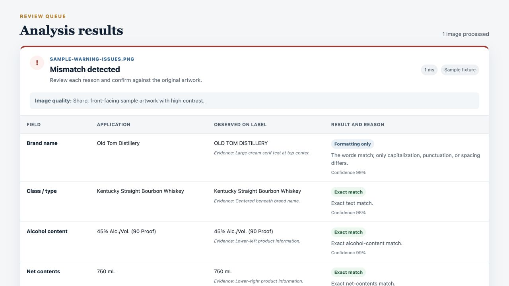

# Label Review Assistant

An AI-assisted alcohol label pre-screening prototype for Treasury's TTB take-home assignment. A reviewer uploads label artwork, enters application values, and receives field-by-field comparisons with extracted evidence, confidence, and reasons. The result deliberately ends at **human review**; it is not a legal approval or rejection.



## What the prototype does

- Accepts PNG, JPEG, and WebP artwork after checking file signatures, not just extensions.
- Compares brand name, class/type, alcohol content, net contents, producer/bottler, country of origin, and the federal government warning.
- Distinguishes exact matches, harmless formatting differences, substantive mismatches, unreadable fields, low-confidence extraction, and fields not supplied on the application.
- Checks exact health-warning wording, case, and punctuation deterministically after extraction.
- Surfaces model-supported visual checks for the all-caps/bold heading, non-bold body, continuous paragraph, separation, and contrast.
- Refuses to claim physical type-size compliance when the pixels do not include a reliable scale reference.
- Supports up to five images in one request with concurrency limited to two and independent partial-error results.
- Handles missing/invalid files, oversized files, timeouts, provider errors, malformed model output, incomplete model output, and unreadable images.
- Keeps uploads in request memory only. There is no database, object storage, or upload directory.

## Quick start

Prerequisite: [.NET 8 SDK](https://dotnet.microsoft.com/download/dotnet/8.0).

```bash
dotnet restore
dotnet run --project src/TreasuryLabelVerifier.Web
```

Open the local URL printed by ASP.NET Core. Development defaults to the credential-free fixture provider; click **Run clear sample** or **Run issue sample** for the complete workflow.

To analyze arbitrary labels, set a server-side API key and switch providers:

```bash
export OPENAI_API_KEY="your-key"
export LabelAnalysis__Provider="OpenAI"
dotnet run --project src/TreasuryLabelVerifier.Web
```

Do not put a real key in `.env`, source files, browser code, screenshots, or Git. `.env.example` documents all supported settings.

## Architecture and data flow

```text
Browser (Razor Pages form)
        │ multipart POST + anti-forgery token
        ▼
File validation (count, length, PNG/JPEG/WebP magic bytes)
        │ in-memory bytes
        ▼
ILabelExtractor
  ├── DemoLabelExtractor (included sample only)
  └── OpenAiLabelExtractor (server-to-server vision request)
        │ strict JSON Schema output → deserialize → semantic validation
        ▼
ComparisonEngine (deterministic C# rules)
        │
        ▼
Evidence, status, reason, confidence, visual checks, human-review banner
```

The model is limited to transcription, confidence, evidence location, and image-supported visual observations. It is explicitly told not to decide compliance. The C# comparison layer owns normalization, thresholds, warning-text strictness, and overall routing. This split makes the consequential behavior testable and prevents free-form model prose from controlling the result.

### Project structure

```text
src/TreasuryLabelVerifier.Web/
  Configuration/       validated runtime options
  Domain/              application, extraction, and result types
  Services/            provider interface, OpenAI/demo extraction, comparison, file validation
  Pages/               accessible Razor Pages UI
  wwwroot/samples/     reproducible SVG source and generated PNG fixture
tests/TreasuryLabelVerifier.Tests/
  comparison and file-validation tests
```

## Technology and model choices

- **ASP.NET Core 8 Razor Pages / C#**: a small, typed, server-rendered .NET application with little client-side complexity, straightforward Azure/Docker hosting, and alignment with the stakeholder's existing .NET environment.
- **No client SPA framework**: reduces build/runtime dependencies and keeps the workflow approachable on older government desktops.
- **OpenAI `gpt-4o-mini` via Chat Completions**: configurable, image-capable, relatively latency/cost conscious, and supports strict structured outputs. The provider uses high-detail image input, a strict JSON Schema, `temperature: 0`, a 15-second default timeout, and `store: false`. The model name is an environment setting so a deployment can benchmark and change it without code edits.
- **Raw typed `HttpClient` integration**: avoids coupling core logic to a fast-moving SDK while still using validated structured JSON. Service failures are translated into safe reviewer-facing messages.
- **xUnit**: focused, deterministic tests for the highest-risk comparison and upload rules.

OpenAI access, pricing, latency, availability, and retention are account/configuration dependent; verify them for the target environment. The current official model catalog is the source of truth: [OpenAI model documentation](https://developers.openai.com/api/docs/models).

## Configuration

ASP.NET Core supports environment variables with `__` for nested keys.

| Variable | Default | Purpose |
|---|---:|---|
| `OPENAI_API_KEY` | none | Required only for the OpenAI provider; server-side secret |
| `LabelAnalysis__Provider` | `Demo` in Development; `OpenAI` otherwise | `Demo` or `OpenAI` |
| `LabelAnalysis__Model` | `gpt-4o-mini` | Vision/structured-output model |
| `LabelAnalysis__TimeoutSeconds` | `15` | Per-image timeout, 1–60 seconds |
| `LabelAnalysis__MaxBatchSize` | `5` | Per-request image cap, 1–10 |
| `LabelAnalysis__MaxFileSizeMb` | `10` | Per-image cap, 1–25 MB |

The demo provider intentionally recognizes only the two included sample PNGs; it never pretends to analyze arbitrary artwork.

## Tests and quality checks

```bash
dotnet format TreasuryLabelVerifier.sln --verify-no-changes
dotnet build TreasuryLabelVerifier.sln --configuration Release
dotnet test TreasuryLabelVerifier.sln --configuration Release --no-build
dotnet publish src/TreasuryLabelVerifier.Web --configuration Release --no-build --output ./artifacts/publish
```

The test suite covers:

- formatting-only brand differences;
- ABV/proof mismatch behavior;
- equivalent liter/milliliter quantities;
- exact health-warning case and punctuation;
- unreadable and below-70%-confidence fields;
- warning-heading bold failures;
- file-signature spoofing, valid PNG signatures, and empty uploads.
- valid provider request/response handling, server-side authorization, and malformed structured-output rejection.

Manual browser verification covers the sample POST workflow, result/evidence rendering, invalid-file error state, semantic labels/headings, mobile overflow at 390 × 844, and browser console errors.

The two synthetic fixtures include a clear label and a warning with incorrect title case, weight, and punctuation. Their editable SVG sources live beside the PNGs. On macOS, regenerate a PNG with `sips -s format png input.svg --out output.png`; Inkscape's `inkscape input.svg --export-filename=output.png` is a cross-platform alternative.

## Observed latency

Measured locally on August 9, 2026 on the development machine after a warm build:

- built-in fixture extraction/comparison reported by the server: **1 ms**;
- one observed browser click-to-render round trip for the fixture: **250 ms**.

These measurements verify application overhead only; they are **not** a live OpenAI latency claim. No API credential was available, so live vision latency has not been measured and the stakeholder's approximately five-second target remains to be benchmarked with representative images and the intended deployment region/account. The UI times out each image after 15 seconds and explains the recovery path.

## Supported fields and comparison behavior

| Field | Behavior |
|---|---|
| Brand name | Exact text; case/punctuation/spacing-only differences are informational |
| Class/type | Exact text; case/punctuation/spacing-only differences are informational |
| Alcohol content | Numeric ABV comparison; optional proof formatting tolerated; conflicting proof flagged |
| Net contents | Exact or equivalent liters/milliliters; other unit systems currently require review/may mismatch |
| Producer/bottler name and address | Optional normalized text comparison |
| Country of origin | Optional normalized text comparison; never inferred from an address |
| Government warning | Exact required wording, capitalization, and punctuation after whitespace-line-wrap normalization |
| Warning visuals | Model-supported heading/body boldness, caps, paragraph, separation, and contrast; unknown is review, not pass |
| Minimum warning type size | Always routed to human measurement unless a reliable physical scale exists |

All categories are accepted so a reviewer can record context, but this prototype applies the same common-field comparison form to distilled spirits, wine, and malt beverages. It does not yet dynamically change mandatory fields by category.

## Assumptions and trade-offs

- Application data is entered manually because direct COLA integration is explicitly out of scope.
- Each selected image is compared independently with one shared application record. This is useful for a small same-product image set or triage batch, not a replacement for importer-scale job orchestration.
- Five files and concurrency two protect memory, API rate limits, and responsiveness in a prototype. Production batch processing should use a queue, per-item application metadata, resumability, and bounded workers.
- A 70% extraction-confidence threshold routes a field to human review. This is a product assumption, not a TTB rule, and should be calibrated with labeled evaluation data.
- Capitalization, punctuation, and spacing are harmless for ordinary name/type fields, but not for the prescribed warning where TTB calls out exact punctuation and capitalization requirements.
- An AI visual judgment may flag likely boldness, separation, and contrast, but cannot reliably prove physical millimeter measurements or every prominence requirement from arbitrary artwork.
- The included SVG/PNG is synthetic test artwork, not an approved label and not evidence of legal compliance.

## Known limitations

- No live-model accuracy or latency benchmark has been run without a supplied API credential.
- A single panel/photo may omit mandatory information located elsewhere on the container; an unreadable/missing result is not proof the complete container lacks it.
- Curved bottles, glare, low resolution, decorative typography, vertical text, and multilingual labels can reduce extraction quality.
- The app does not detect every beverage-specific rule, same-field-of-vision geometry, misleading claims, standards of identity, formula issues, age/origin statements, ingredient disclosures, state rules, or COLA authorization state.
- The category selector does not yet alter which fields are mandatory. Alcohol content, for example, has category-specific exceptions.
- Batch entries share application values and results are request-scoped; there is no queue, history, export, user authentication, audit log, or reviewer annotation workflow.
- API/service retries are intentionally omitted to protect the latency target and avoid duplicate cost; transient failures are clearly retryable by the user.

## Privacy and security

- Uploads are held in memory only and become eligible for collection after the request; no application code writes images to disk or a database.
- Live analysis sends image bytes to the configured model provider. The request sets `store: false`, but the deploying organization must review its provider agreement, abuse-monitoring/data-retention settings, regional processing, and federal requirements.
- The API key is read only on the server. No key or image data is placed in browser JavaScript, logs, URLs, or committed configuration.
- Extension/MIME claims are untrusted; PNG/JPEG/WebP magic bytes, batch count, and file size are validated.
- Structured output is schema-constrained, deserialized into typed records, range/required-field checked, and still treated as untrusted evidence.
- Anti-forgery protection, CSP, `nosniff`, frame denial, no-referrer policy, production HSTS, generic unexpected-error messages, and a non-root container user are enabled.
- A real deployment still needs authentication/authorization, approved telemetry redaction, rate limiting, malware/content scanning policy, secret rotation, dependency scanning, and a documented retention schedule.

## Accessibility and usability

The workflow uses server-rendered semantic regions, headings, labels, validation summaries, live status text, keyboard-focus styles, a skip link, high-contrast status labels with text (not color alone), reduced-motion support, responsive layout, and plain-language recovery messages. Tables retain row/column headers and horizontally scroll on small screens rather than clipping content. Formal Section 508/WCAG conformance testing remains future work.

## Regulatory references

The code implements a narrow pre-screen informed by these authoritative sources; current regulations and TTB guidance always control:

- [27 CFR § 16.21 — mandatory health-warning text](https://www.ecfr.gov/current/title-27/chapter-I/subchapter-A/part-16/subpart-C/section-16.21)
- [TTB — Distilled Spirits Health Warning Statement](https://www.ttb.gov/regulated-commodities/beverage-alcohol/distilled-spirits/ds-labeling-home/ds-health-warning)
- [TTB — Distilled Spirits Mandatory Label Information](https://www.ttb.gov/regulated-commodities/beverage-alcohol/distilled-spirits/ds-labeling-home/ds-brand-label)
- [TTB — Distilled Spirits Alcohol Content](https://www.ttb.gov/regulated-commodities/beverage-alcohol/distilled-spirits/ds-labeling-home/ds-alcohol-content)
- [TTB — Distilled Spirits Net Contents](https://www.ttb.gov/regulated-commodities/beverage-alcohol/distilled-spirits/ds-labeling-home/ds-net-contents)
- [TTB — Wine Brand Label and Mandatory Information](https://www.ttb.gov/regulated-commodities/beverage-alcohol/wine/labeling-wine/wine-labeling-brand-label)
- [TTB — Malt Beverage Mandatory Label Information](https://www.ttb.gov/regulated-commodities/beverage-alcohol/beer/labeling/malt-beverage-mandatory-label-information)

The health-warning implementation uses the prescribed wording and treats all-caps/bold `GOVERNMENT WARNING`, non-bold body, continuous paragraph, separation, contrast, and size as distinct checks. TTB's guidance gives minimum warning type sizes of 1, 2, or 3 mm depending on container volume and maximum characters per inch; the prototype does not infer a physical measurement without scale.

## Deployment

### Docker (platform neutral)

```bash
docker build -t treasury-label-verifier .
docker run --rm -p 8080:8080 \
  -e OPENAI_API_KEY="your-key" \
  -e LabelAnalysis__Provider="OpenAI" \
  treasury-label-verifier
```

Verify `http://localhost:8080/healthz` and then the upload workflow. The image runs as a non-root user and listens on port 8080.

### Azure Container Apps outline

1. Build and push the Docker image to an approved registry.
2. Create a Container App with external HTTPS ingress targeting port 8080.
3. Add `OPENAI_API_KEY` as a Container Apps secret and reference it from the environment; set `LabelAnalysis__Provider=OpenAI`.
4. Configure health probes for `/healthz`, a minimum warm replica if cold-start latency matters, request/body limits, and the approved region/logging policy.
5. Test from a clean browser with a non-sensitive representative label and confirm no image/request payloads appear in logs.

No public repository or deployment has been created yet; those external actions require explicit approval.

## How AI/Codex was used

Codex was used as an implementation partner to inspect the assignment, research current official TTB/OpenAI documentation, scaffold and write the .NET application, generate synthetic fixture artwork from deterministic SVG, create tests and documentation, run local quality checks, and exercise the UI in a browser. Regulatory rules remain linked to authoritative sources, comparison behavior is deterministic/tested C#, and all AI-extracted evidence is presented for human confirmation.
